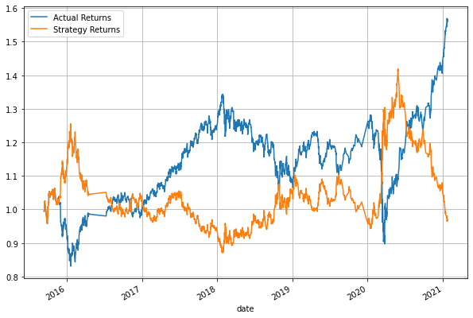

# Machine Learning Trading


This is an algorithmic trading bot that learns and adapts to new data and evolving market.  We will:
* automate a users trade decisions,
* adjust input parameters to optimize the trading algorithm,
* and train a new machine learning model and compare its performance to our original baseline model.

---
## Technologies

This was written in Python 3.7 on a Jupyter Notebook.

Libraries and Dependencies:
* pandas
* NumPy
* hvPlot
* Matplotlib
* scikit-learn

---
## Installations

In terminal, with your conda `dev` environment active, run:

* Install AdaBoost

```python
pip install ada-boost
```
---
## Report - Model Performance Comparison

|          Model         |                     Report                     | Description |
|:-------------------|------------------------------------------------|-------------|
|  Baseline Model  || This is our baseline performance for our trading algorithm.  Performance appears to drop at the start of 2016.  We also noticed a sharp drop in the beginning of 2020 before it recovered.|
|  Tuned Trading Algorithm  ||There was little impact when increasing our trianing window.|
|  Tuned Trading Algorithm - Increased Short Window || By increasing the short window from 4 to 50, the Strategy Returns and Actual Returns were identical and appeared to overlap throughout.  |
|  Tuned Trading Algorithm - Increased Long Window || By increasing the long window from 100 to 200, the Strategy Returns and Actual Returns appeared to be moving in opposite directions of eachother and not one we should use.  |
|  AdaBoost Classifier  ||In this model, our Strategy Returns appear to be identical to our Actual Returns between early 2015 to mid-2018.  It loses in performance throughout 2019 but improves by early 2020.|


### Summary

After comparing each model performance, the original svc model appears to be consistent with each minor improvement, except when we tried to increase the long model's long window.  Including an AdaBoost (Adaptive Boosting) Classifier did show improvement to our model beginning in 2015 and then again in 2019.

---
## Contributors
Christina San Diego [LinkedIn](https://www.linkedin.com/in/christinabuted)