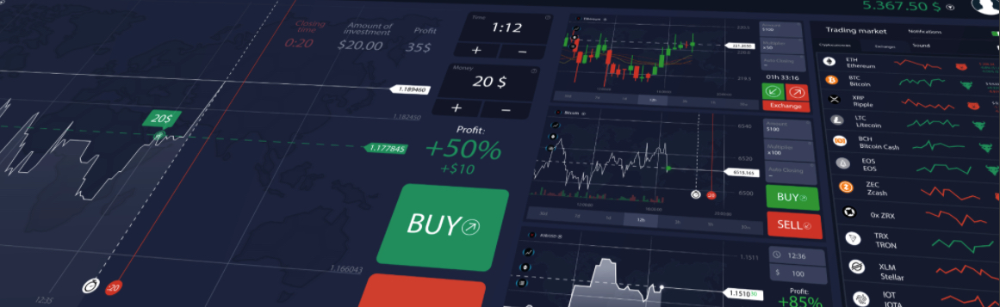
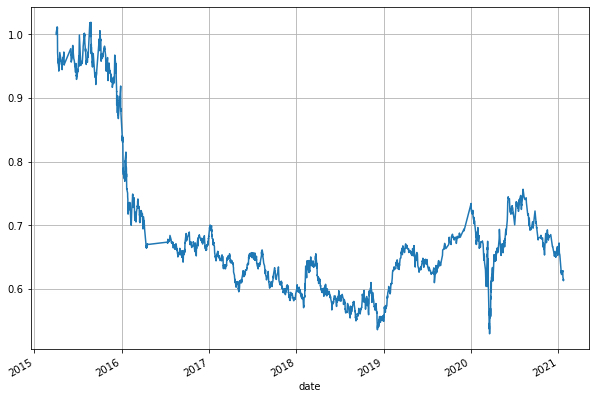
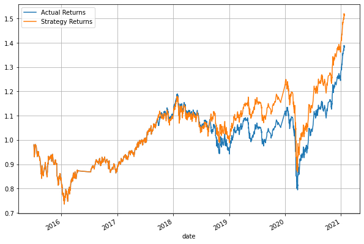
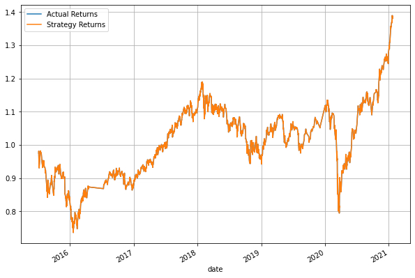
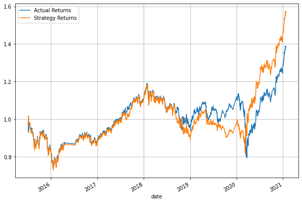

# Machine Learning Trading



This is an algorithmic trading bot that learns and adapts to new data and evolving market.  We will:
* automate a users trade decisions,
* adjust input parameters to optimize the trading algorithm,
* and train a new machine learning model and compare its performance to our original baseline model.

---
## Technologies

This was written in Python 3.7 on a Jupyter Notebook.

Libraries and Dependencies:
* pandas
* NumPy
* hvPlot
* Matplotlib
* scikit-learn

---
## Installations

In terminal, with your conda `dev` environment active, run:

* Install AdaBoost

```python
pip install ada-boost
```
---
## Report - Model Performance Comparison

|          Model         |                     Report                     | Description |
|:-------------------|------------------------------------------------|-------------|
|  Baseline Model  || This is our baseline performance for our trading algorithm.  Performance appears to drop at the start of 2016.  We also noticed a sharp drop in the beginning of 2020 before it recovered.|
|  Tuned Trading Algorithm  ||There was little impact when increasing our trianing window.|
|  Updated Tuned Trading Algorithm || By increasing both short and long windows, there is a slight increase in our Strategy Returns.  Compared to our originally tuned trading algorithm, there does not appear to be much of a difference by changing windows.  |
|  AdaBoost Classifier  ||In this model, our Strategy Returns appear to be identical to our Actual Returns between early 2015 to mid-2018.  It loses in performance throughout 2019 but improves by early 2020.|


### Summary

---
## Contributors
Christina San Diego [LinkedIn](https://www.linkedin.com/in/christinabuted)